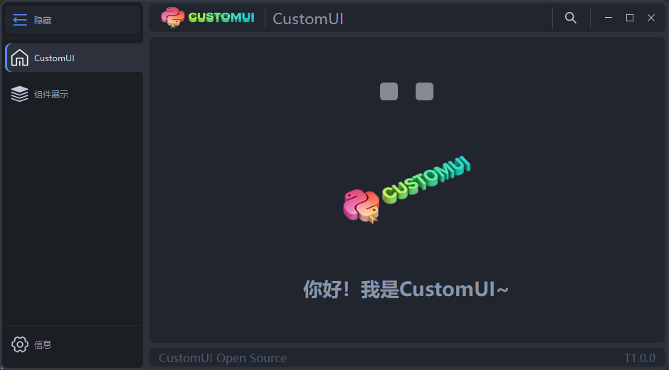
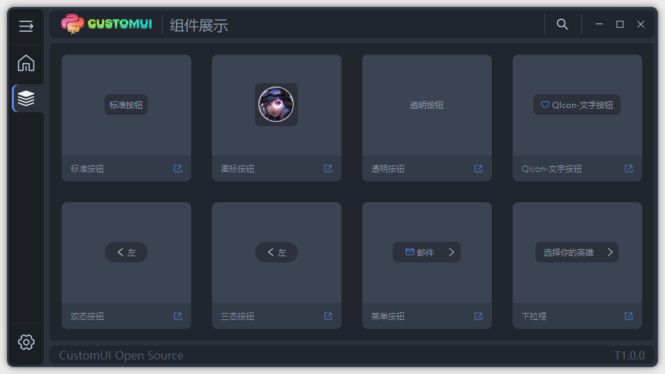
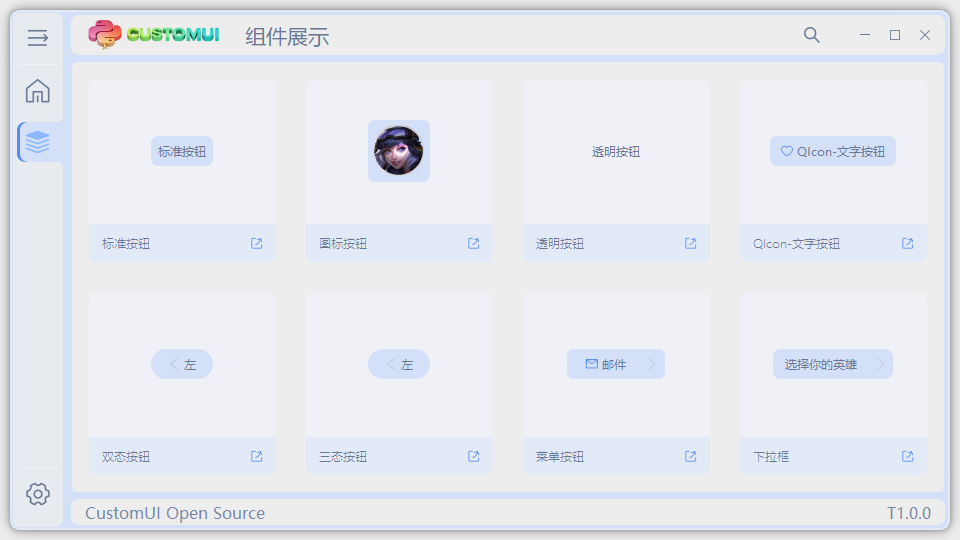
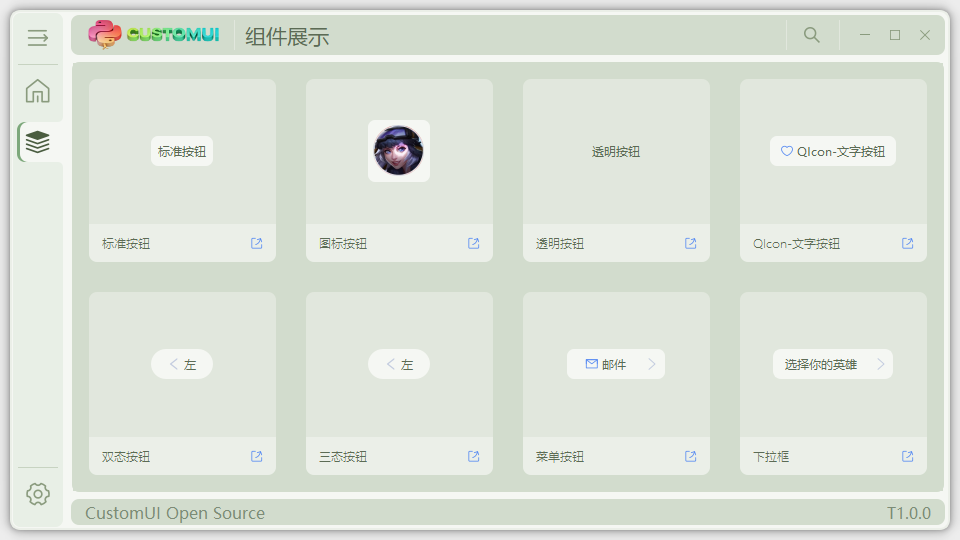
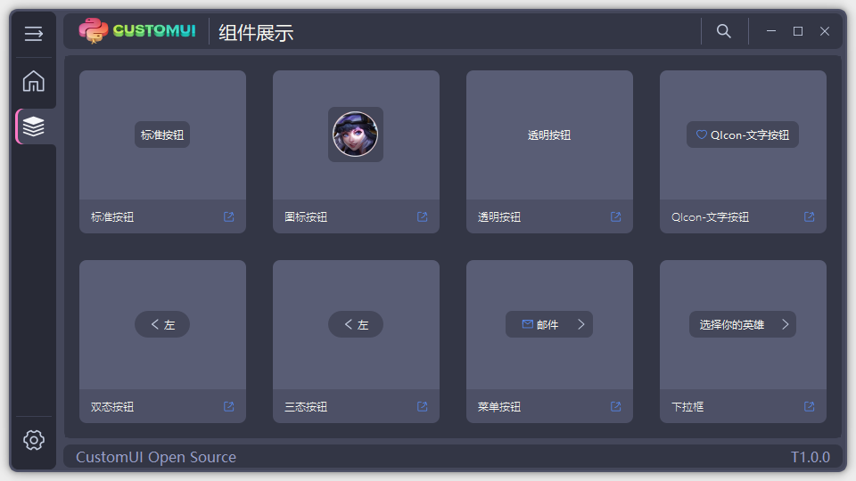

# CustomGUI

#### 简介

一个基于 PySide6 构建的现代化通用 GUI
框架，提供高度可定制的界面组件和模块化设计。项目灵感来源于开源项目 [PyOneDark_Qt_Widgets_Modern_GUI](https://github.com/Wanderson-Magalhaes/PyOneDark_Qt_Widgets_Modern_GUI)。



本项目也在Gitee上开源:[CustomGUI](https://gitee.com/shilianlvke/CustomGUI)
**核心特性**：

- 🎨 内置暗色/亮色主题切换
- 📦 预置现代化 UI 组件（按钮、输入框、表格等）
- 🛠️ 模块化架构，轻松扩展自定义组件
- 📱 响应式布局适配不同分辨率
- 默认黑暗主题：default
  
- 明亮主题：bright
  
- 护眼主题：eye
  
- 梦幻主题：dracula
  

---

#### 技术栈

- **编程语言**: Python >= 3.12
- **GUI 框架**: PySide6 >= 6.10
- **依赖管理**: uv
   ```
  详情可查看pyproject.toml
   ```

---

#### 快速开始

##### 环境配置

1. 克隆仓库
   ```bash
   git clone https://gitee.com/shilianlvke/CustomGUI.git
   cd CustomGUI
   ```

2. 创建虚拟环境和安装依赖
   ```bash
   # Windows PowerShell(项目路径下)
   1. uv python install 3.12
   2. uv venv
   3. uv sync
   ```

3. 安装可选硬件依赖（仅 Windows 串口/HID/网卡扫描功能需要）
   ```bash
   uv sync --extra windows-hardware
   ```

4. 激活虚拟环境
   ```bash
   # Windows PowerShell(项目路径下)
   .\.venv\Scripts\Activate
   ```

##### 运行示例

```bash
uv python main.py
```

---

#### 应用打包

使用 [auto-py-to-exe](https://github.com/brentvollebregt/auto-py-to-exe) 生成独立可执行文件：

1. 安装打包工具
   ```bash
   uv add auto-py-to-exe
   ```

2. 启动图形化打包向导(激活环境后)
   ```bash
   auto-py-to-exe
   ```

**打包配置建议**：
• 选择 `main.py` 作为主脚本
• 启用 `One Directory` 打包模式
• 添加 `ui` 和 `themes` 目录到附加文件

##### 命令行打包（跨平台）

```bash
uv pip install "pyinstaller>=6.10.0"
uv run python scripts/build_package.py
```

构建产物目录：

```text
dist/CustomGUI/
```

##### CI/CD 发布流水线

- `CI` 工作流：用于 lint + 测试
- `Release Build` 工作流：
   - 支持 Windows/Linux 矩阵打包
   - 推送 `v*` tag 自动触发
   - 自动上传构建产物到 GitHub Release

##### 文档自动化（架构图/API）

本地生成文档：

```bash
uv run python scripts/generate_docs.py
```

生成目录：

```text
docs/
```

`Docs` 工作流会在核心代码或脚本变更时自动生成文档，并上传 `docs/` 作为构建产物，同时检查仓库内文档是否与代码保持同步。

##### 迁移与兼容状态（2026-03）

- 历史兼容入口已全部移除：`config_module`、`languge_module`、`ui_mian`
- 规范入口：
   - 配置：`AppCore.get_app_context().settings` / `AppCore.AppSettings`
   - 语言模块：`AppCore.SYS.module.language_module`
   - 加载窗口：`GUI.windows.loading_window.ui_main`
- 兼容与下线记录：`docs/LEGACY_COMPATIBILITY.md`

---

#### 开发指南

1. **项目结构**
   ```
   CustomGUI/
   ├── AppCore/         # 程序核心
   ├── GuiCore/         # UI 核心组件库
   ├── GUI/             # UI 界面基础框架
   ├── resource/        # 配置文件/资源
   ├── main.py          # 主入口
   └── pyproject.toml   # 项目配置信息
   ```

2. **自定义主题**
   修改 `resource\custom_ui\themes` 中的颜色配置，或新增配置文件，参考示例代码：resource\custom_ui\themes\default.yml 和
   resource\loading_config.yml

3. **扩展组件**
   参考示例代码：
   ```
   GuiCore\customui\
   GuiCore\widgets\
   ```

4. **代码质量门禁（推荐）**
   在提交前执行：
   ```bash
   uv run ruff check .
   uv run pytest -q
   ```

   增量开发时可先做“改动文件定向检查”，再跑全量：
   ```bash
   uv run ruff check <changed-files>
   uv run pytest -q
   ```

   可选：自动修复部分可修复问题（如未使用导入）：
   ```bash
   uv run ruff check . --fix
   ```

5. **本地发布前最小检查清单**
   - `uv run ruff check .` 通过
   - `uv run pytest -q` 通过
   - `uv run pytest -q tests/test_legacy_import_policy.py` 通过（防止回退到历史入口）
   - `uv run python scripts/generate_docs.py` 后文档无差异（或已提交文档更新）

---

#### 参与贡献

欢迎通过 Issue 和 PR 参与项目开发，流程如下：

1. Fork 本仓库
2. 创建功能分支 (`git checkout -b feature/AmazingFeature`)
3. 提交代码 (`git commit -m 'Add some AmazingFeature'`)
4. 推送分支 (`git push origin feature/AmazingFeature`)
5. 发起 Pull Request

请确保代码符合 [PEP8](https://peps.python.org/pep-0008/) 规范，并通过 `ruff` 与 `pytest` 检查。

---

#### 许可证

本项目采用 [MIT License](LICENSE)，请自由使用并保留原始作者信息。

#### 代码分支

   ```
master: 主分支-稳定版本
develop：开发分支-最新
   ```
#### 常用指令
### Windows
   ```PowerShell 清除Python产生的所有__pycache__文件夹
Get-ChildItem -Recurse -Directory -Filter '__pycache__' | Remove-Item -Recurse -Force
   ```