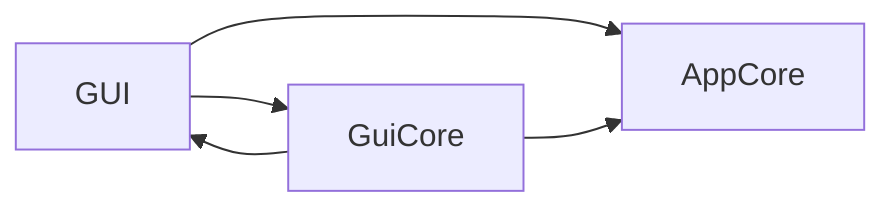

# Architecture

This file is auto-generated by scripts/generate_docs.py.

## High-Level Layers

- AppCore: app context, config loading, modules, logging, tool adapters
- GUI: windows and page assembly
- GuiCore: reusable UI components and style system

## Dependency Graph

